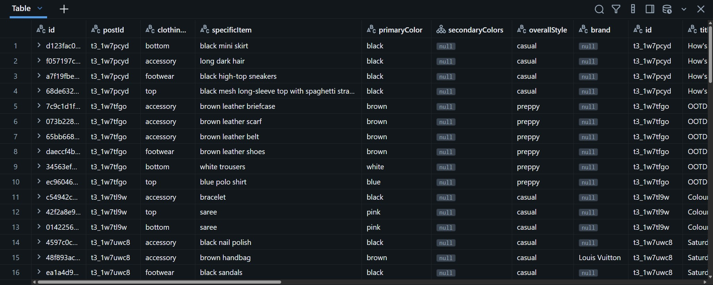

# Reddit Fashion Trend & VLM Ingestion Pipeline



An end-to-end data pipeline that scrapes fashion outfit images from Reddit, extracts structured garment metadata using a local Vision-Language Model (VLM), and ingests the data into a Databricks Lakehouse following Medallion Architecture principles.

---

## Architecture Overview

```text
 Reddit (r/fashion)
         │
         ▼
 ┌───────────────┐
 │ Apify Scraper │ ──> Pulls posts, image URLs, and post metadata
 └───────┬───────┘
         │
         ▼
 ┌───────────────┐
 │   Databricks  │ ──> In-memory ID check: Skip already processed posts
 └───────┬───────┘
         │ (New Posts Only)
         ▼
 ┌───────────────┐
 │   Ollama VLM  │ ──> Local VLM (Qwen2.5-VL) detects items, colors, & styles
 └───────┬───────┘
         │
         ├───> Bronze Table: Raw Reddit Post Metadata (1 row per post)
         └───> Silver Table: Individual Exploded Items (1 row per garment)
```

1. **Scraping**: Fetches fresh image posts from fashion subreddits using the Apify Reddit Scraper actor.
2. **Idempotent Ingestion Check**: Inspects Databricks for existing `post_id` entries prior to inference to avoid duplicate processing and save compute.
3. **Local Computer Vision**: Uses **Qwen2.5-VL** hosted locally via **Ollama** to classify outfit pieces, distinct colors, categories, styles, and visible branding into JSON format.
4. **Lakehouse Ingestion**:
   * **Bronze Layer (`reddit_fashion_posts`)**: Retains raw post metadata (title, post URL, author text, creation timestamp).
   * **Silver Layer (`reddit_fashion_items`)**: Normalizes clothing items into atomic rows with foreign keys (`postId`).

---

## Schema Design

### Bronze Layer: `default.reddit_fashion_posts`
Stores high-level post context.

| Column | Type | Description |
|---|---|---|
| `id` | `STRING` | Reddit Post ID (Primary Key, e.g., `t3_1w88rib`) |
| `title` | `STRING` | Reddit submission title |
| `url` | `STRING` | Direct image URL |
| `body` | `STRING` | Accompanying post self-text or metadata |
| `createdAt` | `STRING` | Original Reddit post creation timestamp |

### Silver Layer: `default.reddit_fashion_items`
Contains exploded clothing records extracted by the VLM.

| Column | Type | Description |
|---|---|---|
| `id` | `STRING` | Unique item identifier (`UUIDv4`) |
| `postId` | `STRING` | Foreign key referencing `default.reddit_fashion_posts.id` |
| `clothingCategory` | `STRING` | Garment type (`top`, `bottom`, `footwear`, `accessory`) |
| `specificItem` | `STRING` | Detailed garment description (e.g., `taupe ankle boots`) |
| `primaryColor` | `STRING` | Primary color (e.g., `white`) |
| `secondaryColors` | `ARRAY<STRING>` | Array of detected secondary colors (e.g., `["taupe"]`, `["light blue"]`) |
| `overallStyle` | `STRING` | Dominant aesthetic (e.g., `casual`, `streetwear`, `formal`) |
| `brand` | `STRING` | Visible branding/logo (`null` if unbranded) |

---

## Setup & Installation

### 1. Prerequisites
* Python 3.10+
* [Ollama](https://ollama.ai/) installed and running locally
* Databricks SQL Warehouse or Compute Cluster
* [Apify](https://apify.com/) account and API token

### 2. Pull the Local VLM
Ensure Ollama is running and pull the vision model:
```bash
ollama pull qwen2.5vl
```

### 3. Clone Repository & Install Dependencies
```bash
git clone [https://github.com/your-username/reddit-fashion-pipeline.git](https://github.com/your-username/reddit-fashion-pipeline.git)
cd reddit-fashion-pipeline

# Create virtual environment
python -m venv venv
source venv/bin/activate  # On Windows use: venv\Scripts\activate

# Install requirements
pip install -r requirements.txt
```

### 4. Configure Environment Variables
Create a `.env` file in the project root directory:
```env
APIFY_KEY=your_apify_api_key_here
DB_TOKEN=your_databricks_personal_access_token
DB_HOST=dbc-xxxxxxxx-xxxx.cloud.databricks.com
DB_HTTP_PATH=/sql/1.0/warehouses/xxxxxxxxxxxxxxxx
```

---

## Databricks Table Initialization

Run the following SQL script in your Databricks SQL Editor prior to the initial pipeline run:

```sql
CREATE TABLE IF NOT EXISTS default.reddit_fashion_posts (
  id STRING,
  title STRING,
  url STRING,
  body STRING,
  createdAt STRING
);

CREATE TABLE IF NOT EXISTS default.reddit_fashion_items (
  id STRING,
  postId STRING,
  clothingCategory STRING,
  specificItem STRING,
  primaryColor STRING,
  secondaryColors ARRAY<STRING>,
  overallStyle STRING,
  brand STRING
);
```

---

## Running the Pipeline

Execute the extraction and ingestion script:

```bash
python fashion_classifier.py
```

### Pipeline Flow:
1. Apify scrapes the latest candidate posts from `r/fashion`.
2. Existing post IDs are pulled from `default.reddit_fashion_posts`.
3. New image candidates are passed to `http://localhost:11434/api/generate`.
4. Extracted items and posts are written directly to Databricks inside a transaction.

---

## Example Analytics Queries

### Find Outfits Featuring White Clothing
```sql
SELECT 
  p.title,
  i.clothingCategory,
  i.specificItem,
  i.primaryColor,
  i.secondaryColors,
  i.overallStyle
FROM default.reddit_fashion_items i
JOIN default.reddit_fashion_posts p ON i.postId = p.id
WHERE i.primaryColor = 'white';
```

### Top Dominant Fashion Styles
```sql
SELECT 
  overallStyle,
  COUNT(*) AS item_count
FROM default.reddit_fashion_items
WHERE overallStyle IS NOT NULL
GROUP BY overallStyle
ORDER BY item_count DESC;
```
